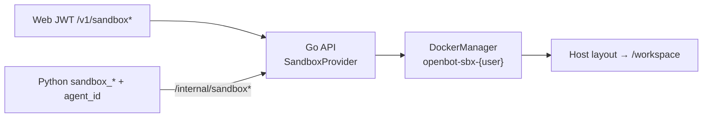

# 沙箱电脑（Sandbox Computer）

> **对用户文案**：沙箱完全透明——只谈结果（预览/下载/回复）；禁止说 sandbox/Docker/容器/`/workspace`/「工作电脑」。设置高级区可称「运行环境（高级）」。客户端路由与 ListMachines 见 [客户端环境与本机.md](./客户端环境与本机.md)。

> Phase 1 MVP（2026-09-24）+ **P0 基础**（Provider / Team·Private / Checkpoint）已实现。  
> P2 桌面预览：本地 noVNC 镜像 + JWT 反代 `/v1/sandbox/desktop`（浏览器不直连 Docker 端口）。

## 架构（P0）



### SandboxProvider 契约（Go）

`services/api/internal/sandbox/provider.go`：

- `Ensure / Stop / Destroy / Exec / ReadFile / WriteFile / ListDir`
- 可选 `Checkpoint / Restore`
- 首个实现：`Manager`（Docker CLI）；便于日后加第二 Provider

### Team vs Private 磁盘布局（默认 team，向后兼容）

**Team（默认）** 宿主机根 ` {SANDBOX_DATA_ROOT}/{user_id}/ ` 挂载为容器 `/workspace`：

```
{user_id}/
  shared/                 → /workspace/shared
  bots/{agent_id}/        → /workspace/bots/{agent_id}
  checkpoints/{ts}/       快照
  private/{agent_id}/     （private 模式使用）
  workspace/              Phase1 遗留；ensure 时迁入 shared/
```

**迁移策略（不删数据）**：首次 team `Ensure` 时，若存在非空 `workspace/` 且 `shared/` 尚无内容，则将 `workspace/` **重命名/搬迁**到 `shared/`，并保留空的 `workspace/` 目录。若 `shared/` 已有文件则不动 legacy。

**Private**：挂载 `{user_id}/private/{agent_id}/` → `/workspace`（该 agent 独占整棵 workspace）。

DB：`sandboxes.computer_mode`、`agents.computer_mode`（`team|private`，默认 `team`）。  
Team 模式下 runtime 传 `agent_id` 时，裸相对路径写入会落到 `/workspace/bots/{agent_id}/`；显式 `shared/` / `bots/` 路径不改写。

### Checkpoint

- 在 **stop / reset** 以及 `POST /v1/sandbox/checkpoint` 时，把 `shared`/`bots`/`private`（及遗留 `workspace`）拷到 `checkpoints/{ts}/`，并写 `checkpoints/LATEST`。
- **Ensure** 时若 live 数据为空且存在 LATEST，则 Restore。
- Docker 不可用时：布局/快照仍可做；容器操作返回 503（soft-fail）。

## 快速试用

```bash
make sandbox-image
# 可选桌面 stub：
make sandbox-image-desktop

make dev-api
TOKEN=...
curl -s -H "Authorization: Bearer $TOKEN" -X POST \
  'http://127.0.0.1:18080/v1/sandbox/ensure?agent_id=open-bot'
curl -s -H "Authorization: Bearer $TOKEN" -X POST \
  http://127.0.0.1:18080/v1/sandbox/checkpoint
```

## JWT / 内部 API（增量）

| 方法 | 路径 | 说明 |
|------|------|------|
| POST | `/v1/sandbox/ensure` | body/query：`agent_id`、`mode`、`desktop=1` |
| POST | `/v1/sandbox/checkpoint` | 显式快照 |
| GET | `/v1/sandbox/desktop/*` | 桌面反代骨架，当前 501/503 |
| POST | `/internal/sandbox/*` | 增加 `agent_id` / `mode` |

## 环境变量

| 变量 | 默认 | 说明 |
|------|------|------|
| `SANDBOX_ENABLED` | `1` | `0` → 503 |
| `SANDBOX_IMAGE` | `openbot-sandbox:dev` | CLI 镜像 |
| `SANDBOX_DESKTOP_IMAGE` | `openbot-sandbox-desktop:dev` | 桌面镜像（可换成 webtop） |
| `SANDBOX_DATA_ROOT` | `$OPEN_BOT_ROOT/data/sandboxes` | 宿主机根 |
| `SANDBOX_MEMORY_MB` / `SANDBOX_CPUS` | `512` / `1` | 配额 |
| `SANDBOX_NETWORK_MODE` | bridge | 可 `none` |

## Phase 2 桌面可视化（已接通）

1. **镜像**：`make sandbox-image-desktop` 构建 `openbot-sandbox-desktop:dev`（Xvfb + fluxbox + x11vnc + noVNC，暴露 6080）。
   - 也可改用现成镜像：`.env` 设 `SANDBOX_DESKTOP_IMAGE=lscr.io/linuxserver/webtop:alpine-xfce` 与 `SANDBOX_DESKTOP_PORT=3000`。
2. **启动**：`POST /v1/sandbox/ensure` body `{"desktop":true}`（或 `?desktop=1`）会选用桌面镜像、映射 `127.0.0.1:随机端口→6080`，并把 `desktop_port` / `desktop_token` 写入 DB。
3. **JWT 反代**：`GET /v1/sandbox/desktop`（及子路径）把 HTTP/WebSocket 代理到容器 noVNC。鉴权支持 `Authorization: Bearer`、`?access_token=`，并写入 `openbot_token` Cookie 以便 iframe 加载静态资源。
4. **Web**：设置 → 运行环境（高级）→「打开桌面」。镜像/Docker 不可用时返回中文错误，不假装成功。

### 验证

```bash
make sandbox-image-desktop
make dev-api   # 另开终端
TOKEN=...      # 登录后的 JWT
curl -s -H "Authorization: Bearer $TOKEN" -X POST   -H 'Content-Type: application/json'   -d '{"desktop":true}'   http://127.0.0.1:18080/v1/sandbox/ensure
# 浏览器打开（带 token）：
# http://127.0.0.1:18080/v1/sandbox/desktop?access_token=$TOKEN
```

Mac Docker Desktop 可运行该 GUI 镜像；若构建失败或端口未映射，API 会返回明确中文提示。

## Phase 3 计划（规模与多机）

每 Agent 会话、闲置 GC、多副本调度、用户注册机器等 — 见历史规划，未实现。

## 相关文件

- Go：`internal/sandbox/{provider,layout,checkpoint,docker}.go`、`db/sandboxes.go`、`httpserver/sandbox.go`
- Python：`app/sandbox.py`；tools 在 `llm.py` / `main.py`
- 镜像：`deploy/sandbox/`、`deploy/sandbox-desktop/`
- Web：设置→运行环境（高级）/ 密钥；聊天 ArtifactCards
