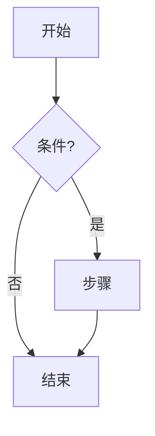
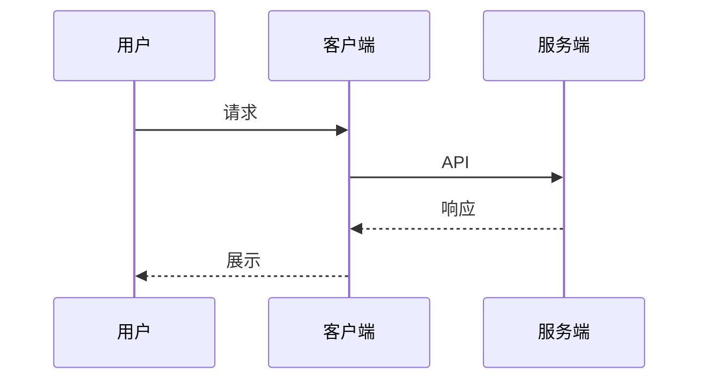
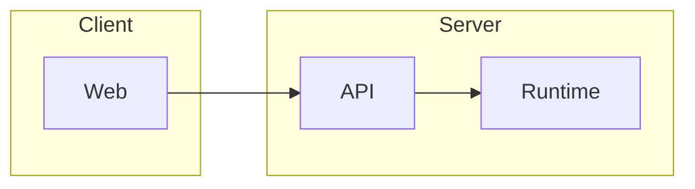
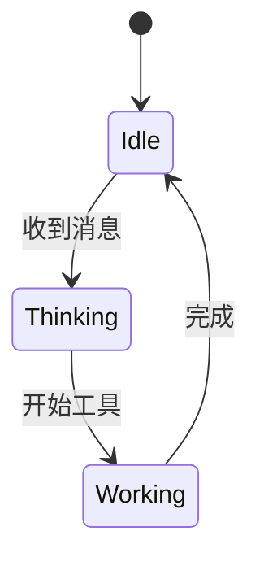

# 画图

用户要图时加载本 skill，再按下面规则输出。普通问答不要加载。

## 1. 选形式

| 需求 | 形式 | 说明 |
|------|------|------|
| 流程、架构、时序、关系、状态、组织、泳道等**结构类图** | **mermaid** | 默认首选；输出完整 ` ```mermaid ` 代码块 |
| 需要自由排版、可点击、自定义样式的示意 | **HTML** | 输出完整 ` ```html ` 代码块（自包含；客户端沙箱预览，不依赖外链脚本） |
| 插画、实物示意、照片级图 | **图片** | 当前若无生成/附件链路，用 mermaid 或 HTML 近似，并一句说明「插画类图待图片链路」；有链路时再出图 |

禁止用空格、符号、emoji 拼字符画或伪表格代替图。

## 2. Mermaid 常用模板（直接改节点文案）

### 流程图 flowchart



### 时序图 sequenceDiagram



### 架构 / 关系（简化）



### 状态图



选型提示：步骤/分支用 `flowchart`；多方调用用 `sequenceDiagram`；状态机用 `stateDiagram-v2`；层级依赖可用 `flowchart` 子图，不必强上 `C4`/`classDiagram` 除非用户点名。

## 3. Mermaid 常见坑（导致客户端渲染失败）

1. **先闭合围栏**：必须是完整的 ` ```mermaid ` … ` ``` `，流式未闭合时客户端会先显示源码。
2. **节点 ID 用英文/数字/下划线**；中文放在 `[]` / `()` / `{}` 标签里，例如 `Login[登录]`，不要写 `登录[登录]` 当 ID。
3. **边标签含括号、冒号、斜杠时加引号**：`A -->|"是(确认)"| B`。
4. **不要用 `end` 当节点 ID**（与子图 `end` 冲突）；改用 `EndNode` / `Finish`。
5. **子图标题避免裸特殊字符**；需要时加引号：`subgraph "API 层"`。
6. **一行一个语句**；箭头用 `-->` / `->>` / `-->>`，不要混用不存在的符号。
7. **不要嵌套 markdown 代码块**；说明文字写在围栏外，一两句即可。
8. **图不要过大**：节点建议 ≤20；过大就拆成多张图或分层。

## 4. HTML 示意（第二选择）

- 单文件：内联 CSS；不加载外部脚本/CDN。
- 不读 cookie、不访问 parent；假定在沙箱 iframe 里预览。
- 仍优先 mermaid 能表达的结构；只有布局/交互明显超出 mermaid 时才用 HTML。

## 5. 输出前自检

发出前在心里过一遍（有校验工具则先调工具再发）：

- [ ] 围栏语言标签正确（`mermaid` 或 `html`）且已闭合
- [ ] 不是字符画 / 伪表
- [ ] 节点 ID 合法；中文只在标签内
- [ ] 边标签特殊字符已加引号
- [ ] 图与用户问题匹配；必要说明 ≤2 句且在围栏外
- [ ] 第一次渲染应能成功：语法按上面模板改，不发明未文档化语法

## 6. 示例对话意图

- 「画一下登录流程」→ `flowchart` mermaid
- 「画个系统架构图」→ `flowchart` + subgraph
- 「画一下 A 调 B 再调 C 的时序」→ `sequenceDiagram`
- 「做个可点的面板示意」→ HTML（若客户端已支持预览）
