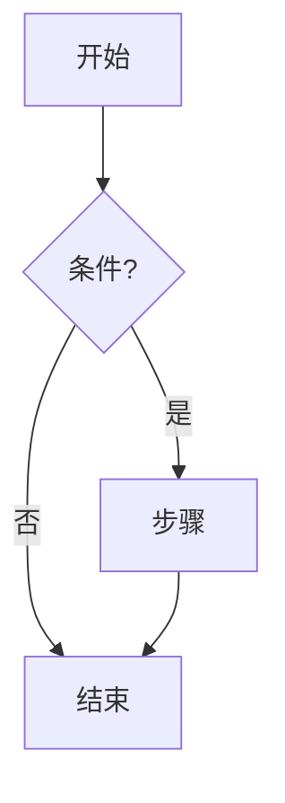
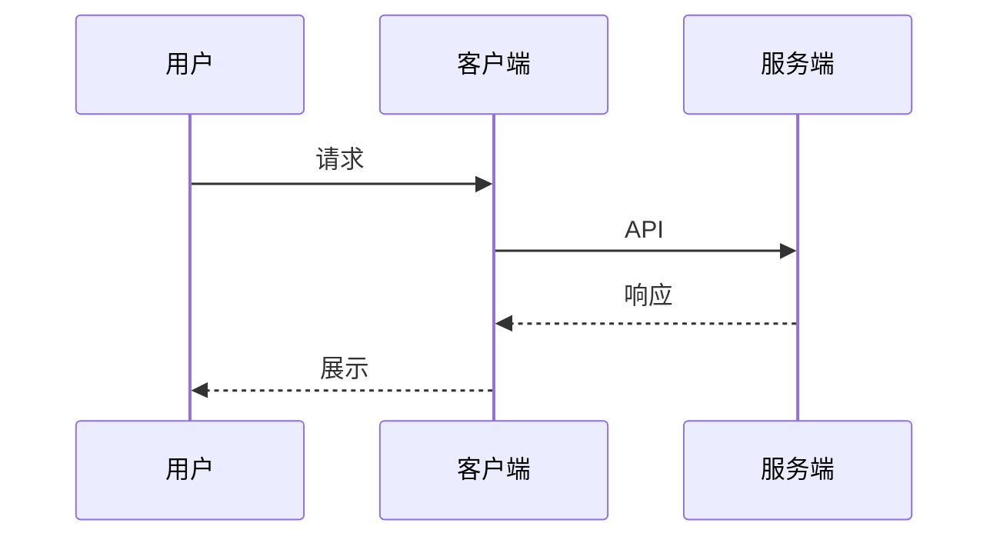
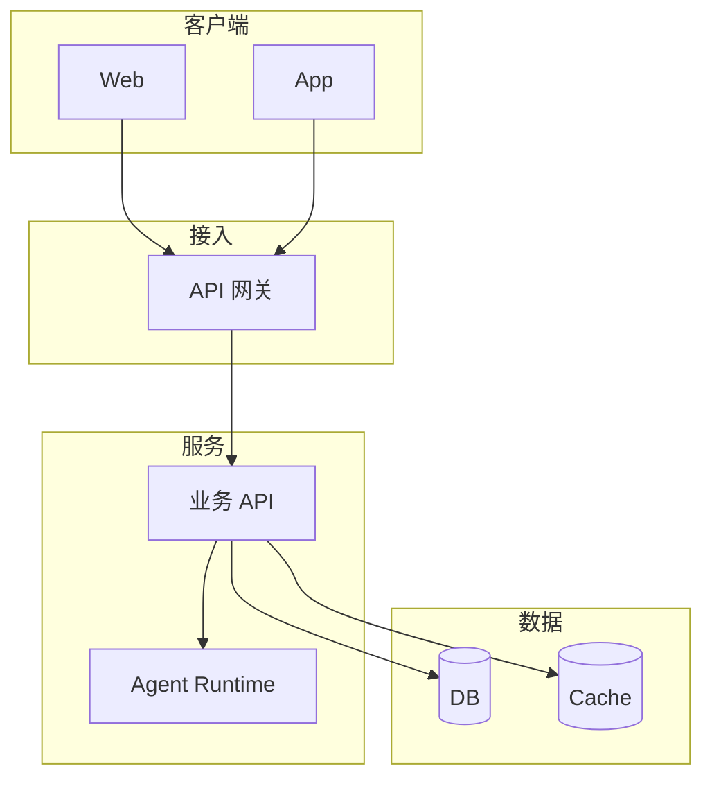
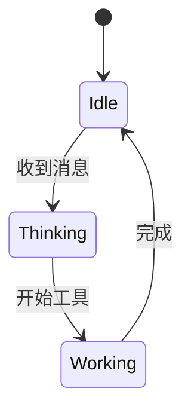

# 画图

用户要图时加载本 skill，再按下面规则输出。普通问答不要加载。

**唯一入口**：结构类图（含「架构图 / 系统图 / 基础设施图」）只走本 skill。仓库里不应再有 `architecture-diagram` 等抢同一意图的 skill。

## 1. 选形式

| 需求 | 形式 | 说明 |
|------|------|------|
| 流程、架构、时序、关系、状态、组织、泳道等**结构类图** | **mermaid** | **默认首选**；输出完整 ` ```mermaid ` 代码块 |
| 需要自由排版、深色科技风 SVG、云/VPC 细排版 | **HTML** | 输出完整 ` ```html ` 代码块（自包含内联 SVG/CSS；无外链脚本；客户端沙箱预览） |
| 插画、实物示意、照片级图 | **图片** | 当前若无生成/附件链路，用 mermaid 或 HTML 近似，并一句说明「插画类图待图片链路」；有链路时再出图 |

「画个系统架构图」「画一下登录流程」等**默认 mermaid**，不要为了好看先上 HTML。禁止用空格、符号、emoji 拼字符画或伪表格代替图。

## 2. Mermaid 常用模板（直接改节点文案）

### 流程图 flowchart



### 时序图 sequenceDiagram



### 架构 / 分层（默认用这个回答「系统架构图」）



### 状态图



选型：步骤/分支 → `flowchart`；多方调用 → `sequenceDiagram`；状态机 → `stateDiagram-v2`；系统/分层架构 → 上面「架构 / 分层」。不必强上 `C4`/`classDiagram` 除非用户点名。

## 3. Mermaid 常见坑（导致客户端渲染失败）

1. **先闭合围栏**：完整 ` ```mermaid ` … ` ``` `；流式未闭合时客户端先显示源码。
2. **节点 ID 用英文/数字/下划线**；中文放在 `[]` / `()` / `{}` 标签里，例如 `Login[登录]`。
3. **边标签含括号、冒号、斜杠时加引号**：`A -->|"是(确认)"| B`。
4. **不要用 `end` 当节点 ID**（与子图 `end` 冲突）；改用 `EndNode` / `Finish`。
5. **子图标题特殊字符加引号**：`subgraph "API 层"`。
6. **一行一个语句**；箭头 `-->` / `->>` / `-->>`。
7. **不要嵌套 markdown 代码块**；说明写在围栏外，≤2 句。
8. **节点建议 ≤20**；过大拆多张或分层。

## 4. HTML 示意（仅当用户明确要自由排版 / 深色科技风）

仍优先 mermaid。仅当用户点名 HTML、或需要 VPC/子网/安全组等 mermaid 难表达的细排版时用 HTML。

要求：
- 单文件；CSS + SVG 内联；**不要**外链脚本（Google Fonts 也可省，用系统等宽字体）。
- 不读 cookie、不访问 parent；假定沙箱 iframe。
- 组件圆角矩形；箭头画在盒子下面（先画线后画盒），避免透明填充透出箭头。

语义配色（深色底 `#020617`）可参考：

| 类型 | Fill | Stroke |
|------|------|--------|
| Frontend | `rgba(8,51,68,.4)` | `#22d3ee` |
| Backend | `rgba(6,78,59,.4)` | `#34d399` |
| Database | `rgba(76,29,149,.4)` | `#a78bfa` |
| Cloud | `rgba(120,53,15,.3)` | `#fbbf24` |
| Security | `rgba(136,19,55,.4)` | `#fb7185` |
| External | `rgba(30,41,59,.5)` | `#94a3b8` |

（配色思路改编自 Hermes Agent / Cocoon AI architecture-diagram，MIT；已并入本 skill，旧 `architecture-diagram` 目录应删除。）

## 5. 输出前自检

- [ ] 围栏语言正确（`mermaid` 或 `html`）且已闭合
- [ ] 不是字符画 / 伪表
- [ ] 节点 ID 合法；中文只在标签内
- [ ] 边标签特殊字符已加引号
- [ ] 「架构图」类问题默认是 mermaid 分层模板，不是 HTML（除非用户点名）
- [ ] 图与问题匹配；说明 ≤2 句在围栏外
- [ ] 第一次应能渲染：按模板改，不发明未文档化语法

## 6. 示例对话意图

- 「画一下登录流程」→ `flowchart` mermaid
- 「画个系统架构图」→ **架构 / 分层** mermaid（本 skill，勿找别的）
- 「画一下 A 调 B 再调 C 的时序」→ `sequenceDiagram`
- 「做个深色 SVG 架构 HTML」→ HTML（第二节选形式）
