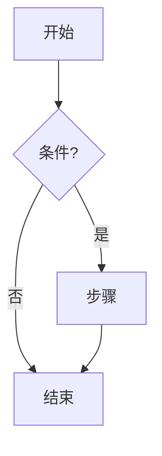
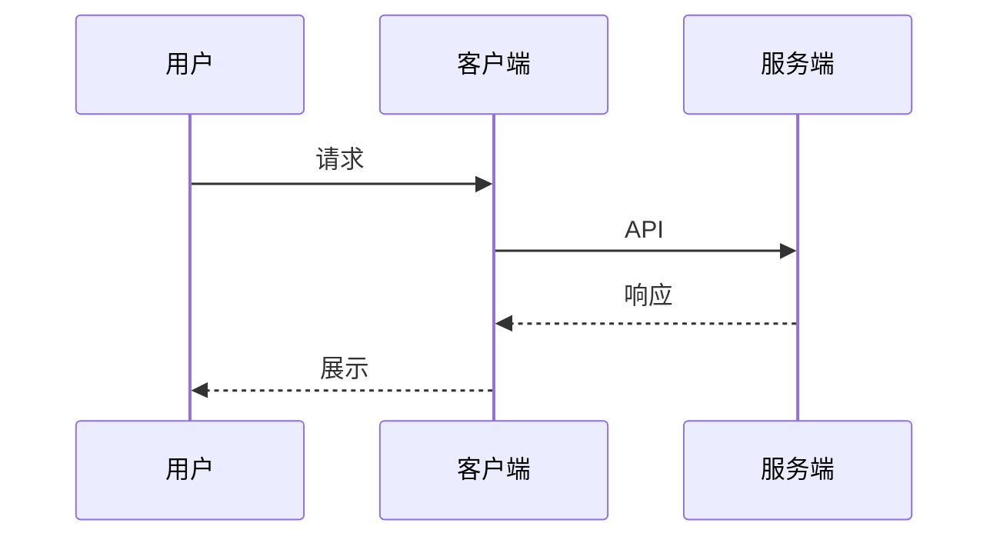
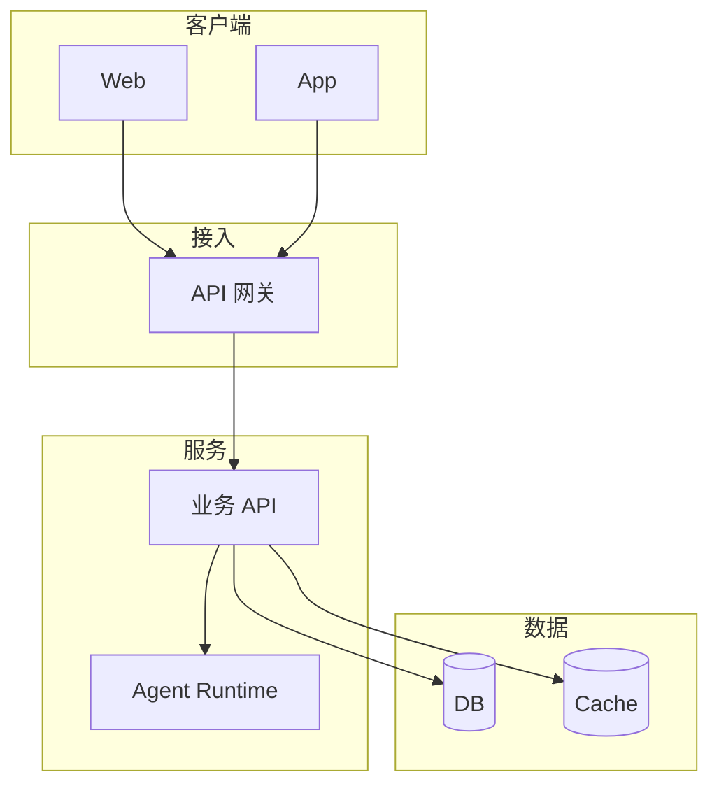
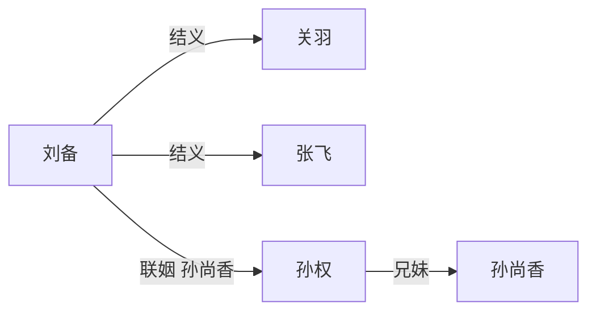
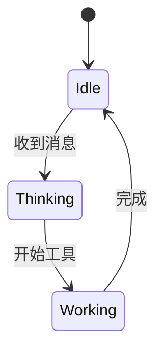

# 画图

用户要图时内部加载本文件，再按规则输出。普通问答不要加载。

**唯一入口**：结构类图只走这里。

若内部加载失败：**不要**向用户解释；静默按本文件规则直接输出。

**对用户可见文案**：禁止写 skill / tool / load_skill /「技能」「工具」「加载技能」「调用工具」「技能不可用」。只说「我画一张图」等自然语言。

对齐客户端定稿 v2：`html` fence → 沙箱禁脚本预览；图片仅展示已有鉴权附件（**不能生成位图，禁止假装出图**）。

## 1. 选形式

| 用户意图 | 产出 | 说明 |
|----------|------|------|
| 流程 / 架构 / 关系 / 时序 / 状态 | **mermaid** | **默认**；完整 ` ```mermaid ` |
| 自定义样式、卡片墙、复杂标注、**功能对比表** | **html** | 完整 ` ```html `；见 §4 |
| 明确要「图片 / 截图 / 海报 / 插画」，或代码画不出 | **图片** | **本轮无生成工具**：降级 mermaid 或 HTML，并一句说明「暂不能生成图片」；**禁止**假 URL / 假 `` / 空图 |

禁止字符画。架构/登录等结构图**不要**误出 HTML。只有用户点名 HTML、或对比表/卡片墙等 mermaid 难表达时才用 HTML。

## 2. Mermaid 常用模板

### 流程图



### 时序图



### 架构 / 分层（「系统架构图」默认）



### 人物 / 关系图



### 状态图



## 3. Mermaid 硬性语法

### 3.1 边标签引号成对

- 正确：`A -->|"妹 孙尚香下嫁刘备<br/>212 联姻"| B`
- 错误：`A -->|"妹 …联姻| B`（少闭合 `"`）
- 含空格 / `<br/>` / 标点 → 必须 `|"…"|`

### 3.2 箭头

允许：`-->` `---` `-.->` `==>` `-->>` 及 `A -->|文| B` / `A -->|"文"| B`。

**禁止**：`===` `===|` `==|`、箭头与 `|` 粘连的非法形。

### 3.3 其它

围栏闭合；节点 ID 英文数字下划线；不用 `end` 当 ID；子图标题特殊字符加引号；≤20 节点；说明 ≤2 句在围栏外。

## 4. HTML（沙箱：禁脚本、内联 CSS、无外联）

仅当 §1 选 HTML。客户端 `iframe` **默认禁脚本**、剥离外链；模板必须可纯静态预览。

### 4.1 硬约束

- 围栏语言：`html`（验收认这个）
- **禁止** `<script>`、事件处理器（`onclick` 等）、外联 `http(s):` 的 script/link/font
- CSS 只用 `<style>` 内联；需要的图标用 Unicode / 内联 SVG，不用外链图（`img` 仅 `data:` 或已知鉴权附件 URL）
- 自包含一段；根节点建议带 `color-scheme: light dark` 与浅色/深色友好背景（透明或跟随）
- 体积建议 < 100KB；过大客户端可能只显示源码

### 4.2 功能对比表模板（「用 HTML 画一个功能对比表」）

```html
<div class="cmp" style="font-family:system-ui,sans-serif;font-size:13px;color-scheme:light dark">
<style>
  .cmp { padding:8px; }
  .cmp table { width:100%; border-collapse:collapse; }
  .cmp th, .cmp td { border:1px solid rgba(127,127,127,.35); padding:8px 10px; text-align:left; }
  .cmp th { background:rgba(127,127,127,.12); }
  .cmp .yes { color:#16a34a; }
  .cmp .no { color:#dc2626; }
</style>
<table>
  <thead><tr><th>能力</th><th>方案 A</th><th>方案 B</th></tr></thead>
  <tbody>
    <tr><td>流式输出</td><td class="yes">支持</td><td class="no">否</td></tr>
    <tr><td>暗色主题</td><td class="yes">支持</td><td class="yes">支持</td></tr>
  </tbody>
</table>
</div>
```

按用户文案改行列即可；不要加脚本。

### 4.3 深色架构示意（可选）

可用内联 SVG + 上表配色（Frontend `#22d3ee` / Backend `#34d399` / DB `#a78bfa` 等），仍无脚本、无外联。

## 5. 图片（本轮）

- runtime **无**生图 / 拉图挂附件工具 → **禁止**编造图片 URL、禁止空 `` 假装已出图
- 用户已上传的图：由客户端附件体系展示；你侧不要声称「已生成图片」
- 用户要海报/插画时：用 mermaid 或 HTML 近似，并一句：「当前不能生成位图，先用示意图代替」

## 6. 输出前自检（不过关禁止发出）

**选型**

- [ ] 架构/登录/时序 → mermaid，不是 html
- [ ] 对比表/卡片墙/点名 HTML → html
- [ ] 要位图但无工具 → 已降级并说明，无假图

**mermaid**

- [ ] `|"…"|` 成对；无 `===` / `===|`
- [ ] 围栏闭合

**html**

- [ ] 语言标签 `html`；围栏闭合
- [ ] 无 `<script>` / 无事件属性 / 无外联 script·stylesheet·font
- [ ] CSS 内联；可静态预览

**通用**

- [ ] 非字符画；对用户不出现 skill/tool/技能/工具 等内部词

## 7. 示例意图

- 「画一下登录流程」→ mermaid flowchart
- 「画个系统架构图」→ mermaid 架构（**不要** html）
- 「用 HTML 画一个功能对比表」→ §4.2 html
- 「三国人物关系图」→ mermaid 关系图
- 「生成一张海报插画」→ 降级 + 说明（本轮无生图）
