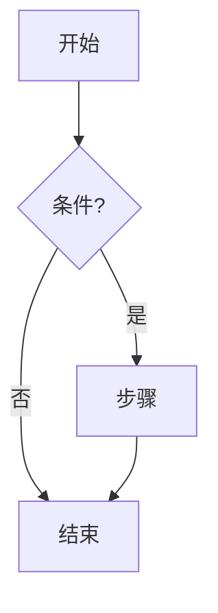
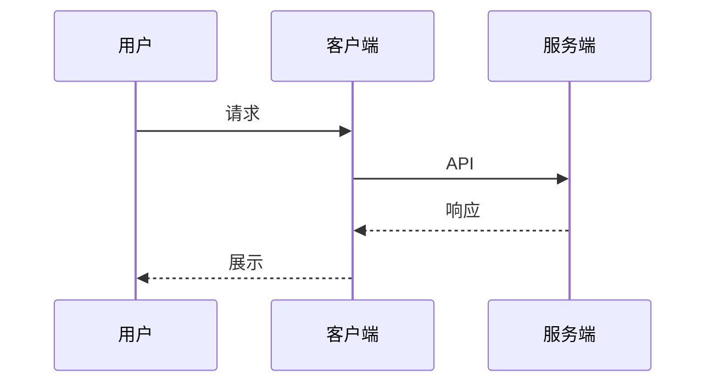
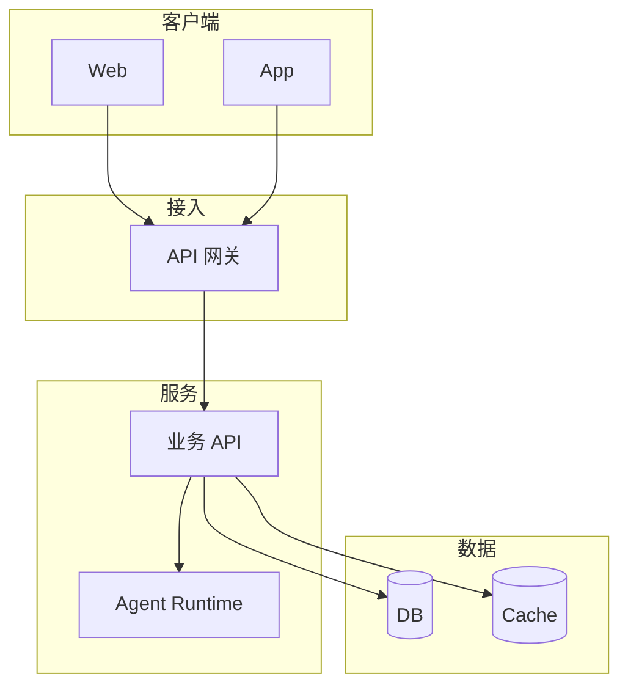
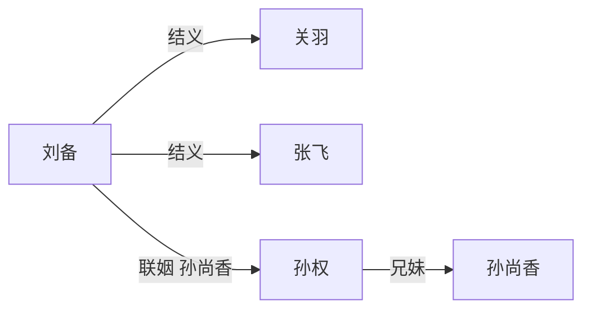
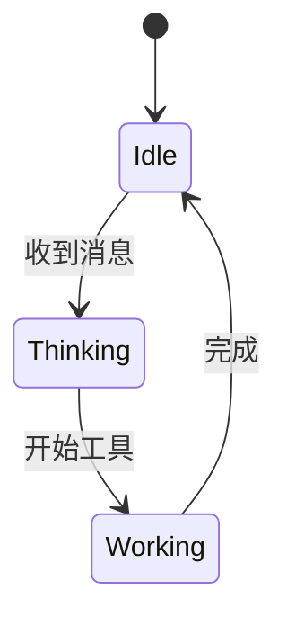

# 画图

用户要图时加载本 skill，再按下面规则输出。普通问答不要加载。

**唯一入口**：结构类图（含「架构图 / 系统图 / 人物关系图」）只走本 skill。

若 `load_skill` 返回 disabled / not found：**不要**对用户说「技能不可用」；静默按本文件规则（或你已读到的副本）直接输出合法 mermaid。

## 1. 选形式

| 需求 | 形式 | 说明 |
|------|------|------|
| 流程、架构、时序、关系、状态、组织、泳道等**结构类图** | **mermaid** | **默认首选**；输出完整 ` ```mermaid ` 代码块 |
| 需要自由排版、深色科技风 SVG、云/VPC 细排版 | **HTML** | 输出完整 ` ```html ` 代码块（自包含内联 SVG/CSS；无外链脚本） |
| 插画、实物示意、照片级图 | **图片** | 无链路时用 mermaid/HTML 近似并一句说明 |

禁止字符画 / 伪表格。默认 mermaid，不要为了好看先上 HTML。

## 2. Mermaid 常用模板（直接改节点文案）

### 流程图 flowchart



### 时序图 sequenceDiagram



### 架构 / 分层



### 人物 / 关系图（flowchart，勿用非法粗箭头）



### 状态图



选型：步骤/分支 → `flowchart`；多方调用 → `sequenceDiagram`；人物/组织关系 → `flowchart`（上表）；系统分层 → 架构模板。

## 3. Mermaid 硬性语法（客户端会回退源码）

### 3.1 边标签引号必须成对

- 正确：`A -->|"妹 孙尚香下嫁刘备<br/>212 联姻"| B`
- 错误：`A -->|"妹 …联姻| B`（少闭合 `"`）
- 有 `<br/>`、中文、空格、标点时**一律**用 `|"…"|`，先写完闭合引号再写目标节点。
- 简单无空格标签可用 `|是|`，一旦含空格/HTML/标点就上引号。

### 3.2 箭头只用合法写法

允许（flowchart）：`-->` `---` `-.->` `==>` `-->>` 以及带标签的 `A -->|文| B` / `A -->|"文"| B`。

**禁止**：`===|` `===` `==|` `-->|`（箭头与 `|` 粘连且无合法标签形）、自造 `***` 粗线。

- 错误：`n3 ===|"联姻"| b1` 或 `n3 ==|"联姻| b1`
- 正确：`n3 -->|"联姻"| b1` 或 `n3 ==>|"联姻"| b1`

### 3.3 其它常见坑

1. 围栏必须闭合：` ```mermaid ` … ` ``` `
2. 节点 ID 英文/数字/下划线；中文只在 `[](){}` 标签内
3. 不用 `end` 当节点 ID
4. 子图标题特殊字符加引号：`subgraph "API 层"`
5. 一行一个语句；说明文字在围栏外 ≤2 句
6. 节点建议 ≤20；关系图过大就拆成多张（核心人物一张、支线一张）

## 4. HTML 示意（仅用户明确要自由排版 / 深色科技风）

单文件、内联 CSS/SVG、无外链脚本。深色底 `#020617` 语义色：Frontend `#22d3ee` / Backend `#34d399` / DB `#a78bfa` / Cloud `#fbbf24` / Security `#fb7185`。

## 5. 输出前自检（不过关禁止发出）

在心里（或有校验工具时先跑）逐条过：

1. 每条边：若出现 `|"`，同一行稍后必须有配对的 `"|`，再接下个节点 ID
2. 全文搜索：无 `===`、无 `===|`、无未闭合的 `|"…|`（缺引号）
3. 用上面「人物 / 关系图」模板的箭头风格，不发明粗箭头
4. 过不了 → **先改简单**（去掉 `<br/>`、改短标签、拆多图），再发；禁止带病输出
5. 不要对用户说「技能不可用 / skill disabled」；load 失败就静默画图

## 6. 示例意图

- 「画一下登录流程」→ flowchart
- 「画个系统架构图」→ 架构 / 分层
- 「三国人物关系图」→ 人物 / 关系图（注意引号与箭头）
- 「做个深色 SVG 架构 HTML」→ HTML
